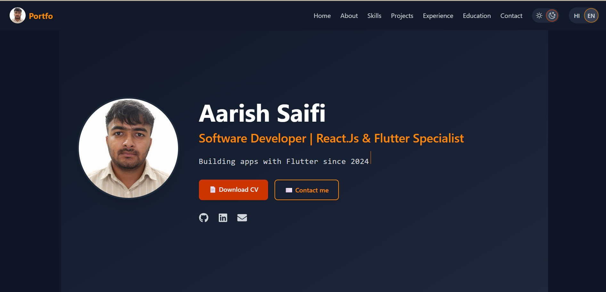

# 🚀 Aarish Saifi — Software Engineer Portfolio



Welcome to my personal portfolio repository.

I’m **Aarish Saifi**, a Software Engineer with around **3 years of experience in software and mobile application development**, specializing primarily in **Flutter and Dart**. This portfolio showcases my technical skills, projects, professional experience, education, and ongoing learning journey.

I’m passionate about building user-friendly applications, solving real-world problems, and continuously exploring modern technologies such as **React.js, Python, AI/GenAI, and modern software development practices**.

---

## 🌐 Live Portfolio

👉 [Visit My Portfolio](https://my-portfolio-gamma-sage-53.vercel.app/)**

---

## ✨ About Me

I’m a Software Engineer focused on developing reliable and user-friendly applications.

My primary experience is with **Flutter and Dart**, including cross-platform mobile development, BLoC/Cubit state management, REST API integration, Firebase, and local databases.

Alongside mobile development, I’m expanding my skills in **React.js, Python, AI/GenAI, Data Analytics, and modern development tools**.

I enjoy learning new technologies, working on practical projects, and turning ideas into functional digital products.

---

## 🛠️ Tech Stack

### 💻 Programming Languages

* Dart
* Python
* C++
* JavaScript
* SQL

### 📱 Mobile Development

* Flutter
* Dart
* BLoC
* Cubit
* Provider
* REST API Integration
* Cross-platform Android & iOS Development
* State Management

### 🌐 Web Development

* HTML5
* CSS3
* JavaScript
* React.js
* Responsive Web Design

### 🗄️ Databases & Backend Services

* Firebase
* SQLite
* MySQL
* Firebase Authentication
* Cloud Firestore
* Firebase Cloud Messaging

### 🤖 AI & Modern Technologies

* Generative AI — Basic
* Prompt Engineering
* AI-assisted Development
* ChatGPT
* GitHub Copilot
* Python for AI/ML — Learning

### 🔧 Tools & Platforms

* Git
* GitHub
* VS Code
* Android Studio
* Postman
* Firebase
* Vercel
* Agile / Scrum

### 🧠 Core Concepts

* Data Structures & Algorithms
* Object-Oriented Programming
* Problem Solving
* Software Development Life Cycle
* State Management
* REST APIs
* Version Control

---

## 📂 Featured Projects

### 🩺 MediMate — Doctor Appointment App

**Flutter • Dart • BLoC/Cubit • REST API**

A learning/internship-level doctor appointment application developed using Flutter.

**Key Features:**

* Doctor listing
* Appointment-related functionality
* REST API integration
* BLoC/Cubit state management
* User-friendly mobile UI
* Cross-platform Flutter development

---

### 💼 Personal Portfolio Website

**React.js • JavaScript • HTML • CSS • Vercel**

A responsive personal portfolio website created to showcase my:

* Professional profile
* Technical skills
* Projects
* Experience
* Education
* Contact information
* GitHub and professional profiles

The website is deployed online and can be accessed through a public URL.

---

## 💼 Experience

### Software / Mobile Application Development

**Around 3 Years of Experience**

Worked on software development projects with a primary focus on:

* Flutter application development
* Dart programming
* REST API integration
* BLoC/Cubit state management
* Firebase services
* Local database integration
* Debugging and issue resolution
* Git/GitHub version control
* Application UI development
* Agile/Scrum development practices

---

## 🎓 Education

### Bachelor of Technology — Computer Science & Engineering

**B.Tech CSE**

Studied core areas including:

* Programming
* Data Structures & Algorithms
* Object-Oriented Programming
* Database Management
* Software Engineering
* Computer Science Fundamentals

### Senior Secondary — Class 12

**PCM — Physics, Chemistry & Mathematics**

---

## 🌱 Currently Learning

I believe continuous learning is an important part of software engineering.

Currently exploring:

* ⚛️ React.js
* 🐍 Python
* 🤖 Artificial Intelligence
* 🧠 Generative AI
* 📊 Data Analytics
* 📈 Data Science
* 🐳 Docker
* ⚙️ DevOps
* ☁️ Cloud Technologies
* 🔗 AI Integration with Applications

---

## 🎯 Career Objective

I’m looking for opportunities where I can use my existing software development experience while continuing to grow with modern technologies.

I’m particularly interested in roles related to:

* Software Engineering
* Flutter Development
* Mobile Application Development
* Frontend Development
* React.js
* Python
* AI/GenAI
* Full-Stack Development

---

## 📊 Portfolio Highlights

| Area                  | Details                                       |
| --------------------- | --------------------------------------------- |
| 💼 Experience         | ~3 Years                                      |
| 🎓 Education          | B.Tech — Computer Science & Engineering       |
| 📱 Primary Technology | Flutter                                       |
| 💻 Primary Language   | Dart                                          |
| 🌐 Web                | React.js, JavaScript, HTML, CSS               |
| 🗄️ Databases         | Firebase, SQLite, MySQL                       |
| 🤖 AI                 | Basic AI/GenAI & AI-assisted development      |
| 🔧 Tools              | Git, GitHub, VS Code, Android Studio, Postman |
| 🚀 Deployment         | Vercel                                        |

---

## 📬 Connect With Me

I'm open to software development opportunities, collaborations, and professional connections.

* 🌐 Portfolio: https://my-portfolio-gamma-sage-53.vercel.app/
* 💻 GitHub: https://github.com/ayrishsaifi
* 💼 LinkedIn: https://www.linkedin.com/in/aarish-saifi-ab46a4221/
* 📧 Email: saifiaaarish@gmail.com

---

## 🚀 Run This Project Locally

Clone the repository:

```bash
git clone YOUR_GITHUB_REPOSITORY_URL
```

Navigate into the project:

```bash
cd my-portfolio
```

Install dependencies:

```bash
npm install
```

Start the development server:

```bash
npm run dev
```

Open the local development URL shown in your terminal.

---

## 🏗️ Build for Production

Create a production build:

```bash
npm run build
```

Preview the production build:

```bash
npm run preview
```

---

## 🚀 Deployment

This portfolio can be deployed using platforms such as:

* Vercel
* Netlify
* GitHub Pages

For my deployment, I use **Vercel**.

Whenever changes are pushed to the connected GitHub repository, the deployment can automatically update.

---

## 📁 Project Structure

```text
my-portfolio/
│
├── public/
│   └── img/
│
├── src/
│   ├── components/
│   ├── sections/
│   ├── assets/
│   ├── hooks/
│   ├── configs/
│   └── main.jsx
│
├── package.json
├── index.html
└── README.md
```

---

## ⭐ Why This Portfolio?

This portfolio is designed to provide recruiters and hiring managers with a quick overview of:

* My professional background
* Technical skills
* Development experience
* Projects
* Education
* Current learning journey
* Contact and professional profiles

---

## 📄 License

This project is intended for personal portfolio and educational purposes.

---

### 👨‍💻 Built By

**Aarish Saifi**

**Software Engineer | Flutter Developer | React.js & AI/GenAI Enthusiast**

> 🚀 Building. Learning. Improving. Repeating.
